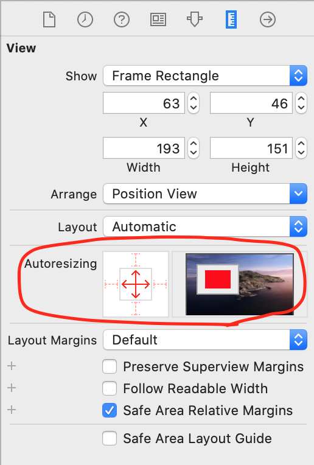
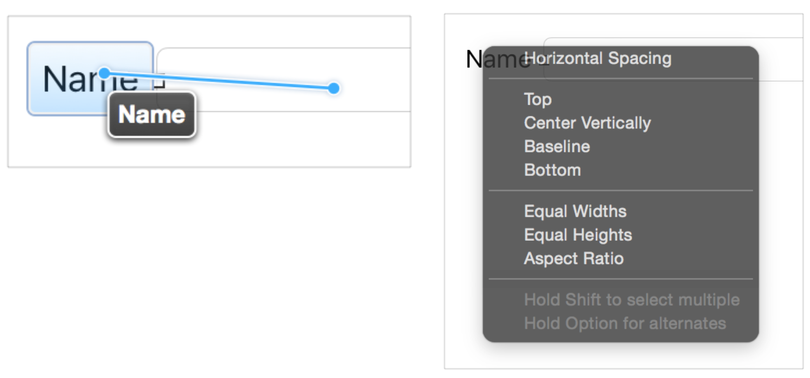
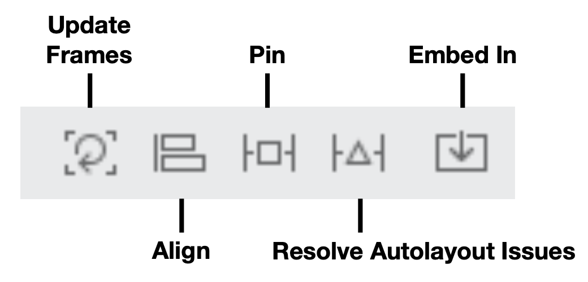
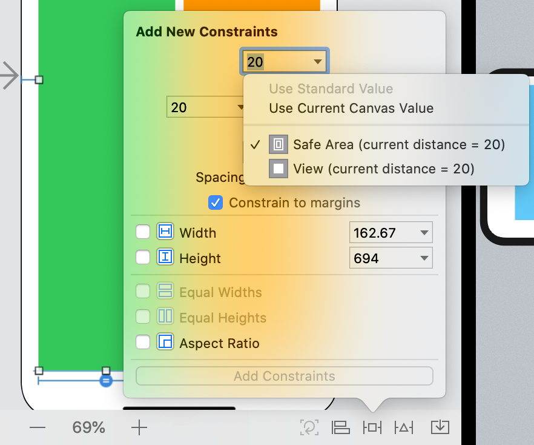
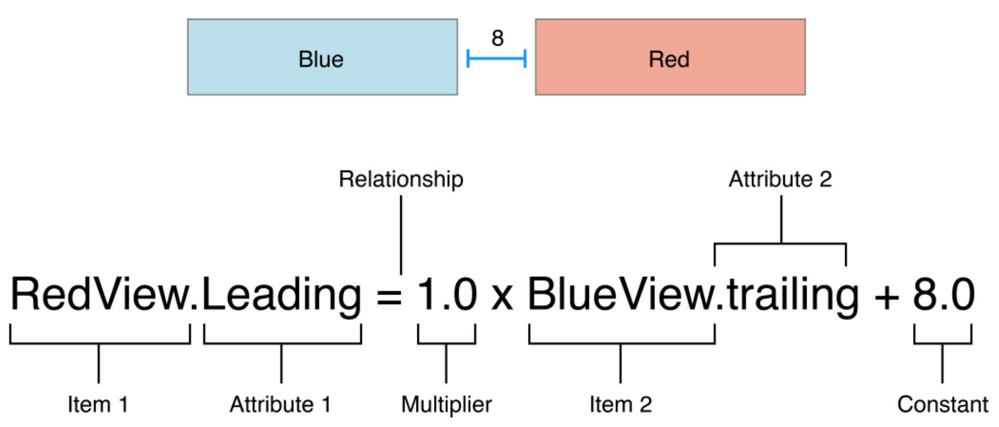

# AutoLayout(스토리보드)

## 정의

* 뷰에 주어진 제약조건에 따라 뷰의 크기와 위치를 동적으로 계산해 배치하는 것
* 외부 또는 내부의 변화에 동적으로 반응하여 유저 인터페이스 구성

 

## 변화요소

### 1. 외적

1. 서로 다른 크기 기기
2. 기기 회전
3. Split View로 진입하거나 빠져나올 때

### 2. 내적

1. 앱에서 보여지는 컨텐츠 변화
2. 국제화 지원(텍스트, 날짜, 숫자 등등)
3. Dynamic Type 지원(글짜 크기)\
 
## 접근방식

### 1. Frame 기반의 프로그래밍 방식

* 코드로 작성하는거(강의 초반에 배운 방식)
* 뷰에 대한 개별적 설정이 가능하나 반대로 동적변화에는 유연하게 대응하기 힘들다
* 빠르다(의미 없다)
 
### 2. Auto Resizing 방식

* 스토리보드에서 디폴트 방식

 
### 3. Auto Layout

* 뷰 간에 상대적인 설정으로 동적변화에 유연하게 대응할 수 있다.
* 느리다(의미 없다)
* 대세다
 
## Auto Layout

### 1) Control-Dragging Constraints

* 마우스 오른쪽 클릭으로 드래그하여 적용

 
### 2) Auto Layout Tools

* 스토리보드 하단 메뉴에 존재

1. Update Frames: 제약조건과 맞지 않는 뷰 위치 갱신

2. Align: 정렬에 관한 제약사항 설정

3. Pin: 간격, 크기, 비율 등에 대한 제약 조건 설정

     1. 어떤 뷰와 상대적 거리를 설정할건지 선택할 수 있다.
     
     2. 두 요소를 동시에 선택하면 Equal Widths/Equal Heights 옵션을 사용할 수 있다.

4. Resolve Autolayout Issues: 오토레이아웃 관련 문제 자동 해결

5. Embed In: 컨테이너 뷰 / 뷰컨트롤러 추가
 
### 3) Anatomy of Constraints

* second item(BlueView, Item2)에 각종 연산을 해서 first item(RedView, Item1)이 된다.
* first item은 second item에 각종 연산을 한 값과 같다.

 
### 4) Leading vs Left

* left: 절대적 왼쪽
* leading: 상대적 위치(아랍권은 right, 한국은 left)

### 5) Layout Guide

* ios 7 이하 top/bottom guide
* ios 11 이상 safe area guide
* 디스플레이 모양말고도 뷰 컨트롤러에 따라서(네비게이션 컨트롤러 사용 여부 등) 달라질 수 있음

