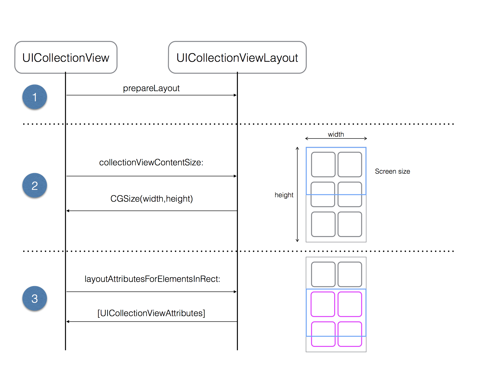
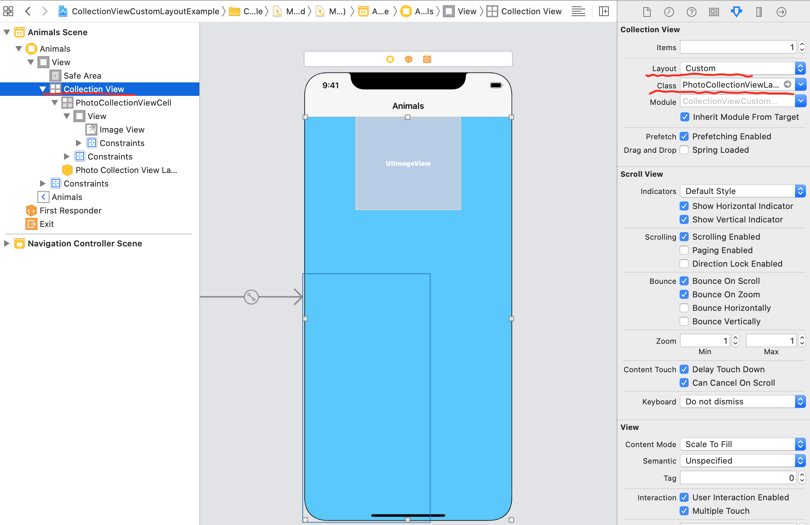

# Custom layout

## 1. 개념도



prepare 에서 필요한 어트리뷰트를 미리 저장(캐싱)

인렉트 사각형이 나타내는 사각형들만 만들어서 반환함(어트리뷰트 반환)

실제 화면이 보여질때 인렉트를 호출

실제 전체 어디까지 나타내야하는지 cgszie로 알려줌

## 2. View Controller 작성 (UICollectionView)

### Collection View 생성(Storyboard)

Layout 종류를 Custom으로 설정

Layout 내용을 서술해 놓은 클래스파일(PhotoCollectionVeiwLayout.swift) 연결



IBOutlet 연결

```swift
@IBOutlet private weak var collectionView: UICollectionView! {
        didSet {
            let layout = collectionView.collectionViewLayout
            if let photoLayout = layout as? PhotoCollectionViewLayout {
                photoLayout.delegate = self
            } else {
                
            }
        }
    }
```

### 데이터소스 정의

```swift
extension ViewController: UICollectionViewDataSource {
	// 셀의 갯수
  func collectionView(_ collectionView: UICollectionView, numberOfItemsInSection section: Int) -> Int {
    return photos.count
  }
  
	// 각 셀의 데이터
  func collectionView(_ collectionView: UICollectionView, cellForItemAt indexPath: IndexPath) -> UICollectionViewCell {
    let cell = collectionView.dequeueReusableCell(withReuseIdentifier: PhotoCollectionViewCell.identifier, for: indexPath) as! PhotoCollectionViewCell
    
    let photo = photos[indexPath.item]
    if let image = UIImage(named: photo.imageName) {
      cell.configureCell(image: image)
    }
    return cell
  }
}
```

### 델리게이트 정의

```swift
// MARK: - UICollectionViewDelegate
// 셀들이 나타날때 어떤 방식으로 등장할지 결정
extension ViewController: UICollectionViewDelegate {
    func collectionView(_ collectionView: UICollectionView, willDisplay cell: UICollectionViewCell, forItemAt indexPath: IndexPath) {
        cell.layer.opacity = 0
        cell.transform = CGAffineTransform(scaleX: 1.1, y: 1.1).translatedBy(x: 10, y: 0)
        
        // 애니메이션 방법 1
//        UIView.animate(withDuration: 0.45, animations: {
//            cell.layer.opacity = 1
//            cell.transform = .identity
//        })
        
        // 애니메이션 방법 2
        UIViewPropertyAnimator.runningPropertyAnimator(withDuration: 0.45, delay: 0, options: [], animations: {
            cell.layer.opacity = 1
            cell.transform = .identity
        })
    }
}

// MARK - PhotoCollectionViewLayoutDelegate
// 내가 정의한 대로(커스텀 델리게이트) 이미지 사이즈를 반환
extension ViewController: PhotoCollectionViewLayoutDelegate {
    func photoCollectionView(_ collectionView: UICollectionView, layout collectionViewLayout: PhotoCollectionViewLayout, sizeForPhotoAt indexPath: IndexPath) -> CGSize {
        guard let image = UIImage(named: photos[indexPath.item].imageName) else {return .zero}
        return image.size
    }
}
```

## 3. Custom Layout 작성(UICollectionViewLayout)

화면에 어떻게 그려질건지 정해줘야함

flow layout 같은 경우엔 기본값들(itemSzie⇒50, lineSpacing⇒10 등등)이 다 존재해서 코딩 안해줘도 됨)

### 레이아웃에 필요한 기본값 정의

```swift
final class PhotoCollectionViewLayout: UICollectionViewLayout {
    
    struct Layout {
        let numberOfColumns: Int
        let itemSize: CGSize
        let lineSpacing: CGFloat
        let interItemSpacing: CGFloat
        
        static let `default` = Layout(
            numberOfColumns: 2,
            itemSize: CGSize(width: 160, height: 120),
            lineSpacing: 10,
            interItemSpacing: 10
        )
    }
    
    // 델리게이트 할당
    weak var delegate: PhotoCollectionViewLayoutDelegate! // 델리게이트 적용하는 곳에서 무조건 사용해야함
    
    var layout: Layout = .default
    
    // 공통 사용 변수
    private var layoutAttributes: [UICollectionViewLayoutAttributes] = [] // 레이아웃 속성 배열. 컬렉션뷰가 여기서 꺼내가서 대체함.
    private var contentHeight: CGFloat = 0
    private var contentWidth: CGFloat { // 연산프로퍼티
        guard let cv = collectionView else { return 0}
        let horizontalContentInset = cv.contentInset.left + cv.contentInset.right
        return cv.bounds.width - horizontalContentInset
    }
```

### 1단계(prepare)

이미지의 크기를 유연하게 적용하기 위해 커스텀 델리게이트도 사용

```swift
protocol PhotoCollectionViewLayoutDelegate: class {
    func photoCollectionView(_ collectionView: UICollectionView, layout collectionViewLayout: PhotoCollectionViewLayout, sizeForPhotoAt indexPath: IndexPath) -> CGSize
}
```

prepare 작성

```swift
//1단계 -  prepare
    override func prepare() {
        guard let collectionView = collectionView, layoutAttributes.isEmpty else {return}
        
        let columnsCount = layout.numberOfColumns
        let totalItemSpacing = CGFloat(columnsCount - 1) * layout.interItemSpacing // 간격을 전부 빼면 셀의 크기기 된다. 근데 하나 빼서 곱해야 된다.
        let cellWidth = (contentWidth - totalItemSpacing) / CGFloat(columnsCount)
        
        //사각형 하나가 추가되면 사각형 크기 만큼 떨어진 곳에 yOffset, xOffset. 컬럼별로 관리를 하기위한 코드
        var xOffset: [CGFloat] = [] // 빈 배열로 초기화
        var yOffset: [CGFloat] = Array(repeating: 0, count: columnsCount) // 걍 0으로 초기화하는 부분.
        
        // 각 변수에 값 넣어주기
        for column in 0..<columnsCount {
            let startOffset = CGFloat(column) * (cellWidth + layout.interItemSpacing)
            xOffset.append(startOffset)
        }
        let numberOfItem = collectionView.numberOfItems(inSection: 0) // 섹션이 1개일때
        var columnIndex = 0
        
        for item in 0..<numberOfItem { // n개의 아이템이 어떤 모양을 할지 여기서 정해줌
            let indexPath = IndexPath(item: item, section: 0)
//            let photoSize = layout.itemSize // 이렇게 하면 다 똑같은 사이즈로 나온다. 그래서 아래 줄.
            let photoSize = delegate.photoCollectionView(collectionView, layout: self, sizeForPhotoAt: indexPath) // 위에서 만든 indexPath를 쓴다.
            let ratio = photoSize.width / cellWidth // 가로가 1500이다. 그럼 300으로 나누면 5.
            let cellHeight = (photoSize.height) / ratio // 높이가 1000 이다. 그럼 1000/5 = 200
            
            let minYOffset = yOffset.min() ?? 0
            columnIndex = yOffset.firstIndex(of: minYOffset) ?? 0 // 균형있게 사진을 로딩하기 위한
            
            let attributes = UICollectionViewLayoutAttributes(forCellWith: indexPath)
            attributes.frame = CGRect(x: xOffset[columnIndex], y: yOffset[columnIndex], width: cellWidth, height: cellHeight)
            
            layoutAttributes.append(attributes)
            
            yOffset[columnIndex] += cellHeight + layout.lineSpacing // 새로 생성할때마다 y오프셋을 계속 내려서 다음꺼의 y오프셋을 설정
        }
        
        self.contentHeight = (yOffset.max() ?? 0) - layout.lineSpacing // 와이오프셋의 맥스가되면 라인스페이싱을 한번 빼줘야함
    }
```

### 2단계(collectionViewContentSize)

```swift
// 2단계 - collectionViewContentSize를 반환
    override var collectionViewContentSize: CGSize {
        guard let _ = collectionView else { return .zero}
        return CGSize(width: contentWidth, height: contentHeight)
    }
```

### 3단계(layoutAttributeForElements)

```swift
// 3단계 - layoutAttributeForElements(in rect: CGRect)
    override func layoutAttributesForElements(in rect: CGRect) -> [UICollectionViewLayoutAttributes]? {
        // 보여질 화면만 돌려준다
        return layoutAttributes.filter({$0.frame.intersects(rect)}) // rect 안에 포함되는 프레임을 가진 놈만 필터링을 해서 가져온다.
    }
    
    override func layoutAttributesForItem(at indexPath: IndexPath) -> UICollectionViewLayoutAttributes? {
        return layoutAttributes.first{$0.indexPath == indexPath} // 특정 아이템에 대한 정보를 반환
    }
```