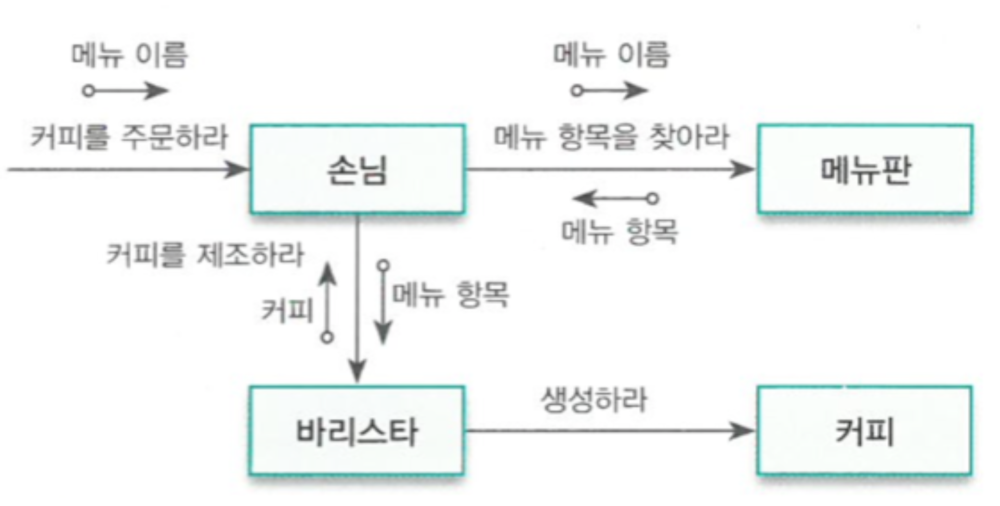
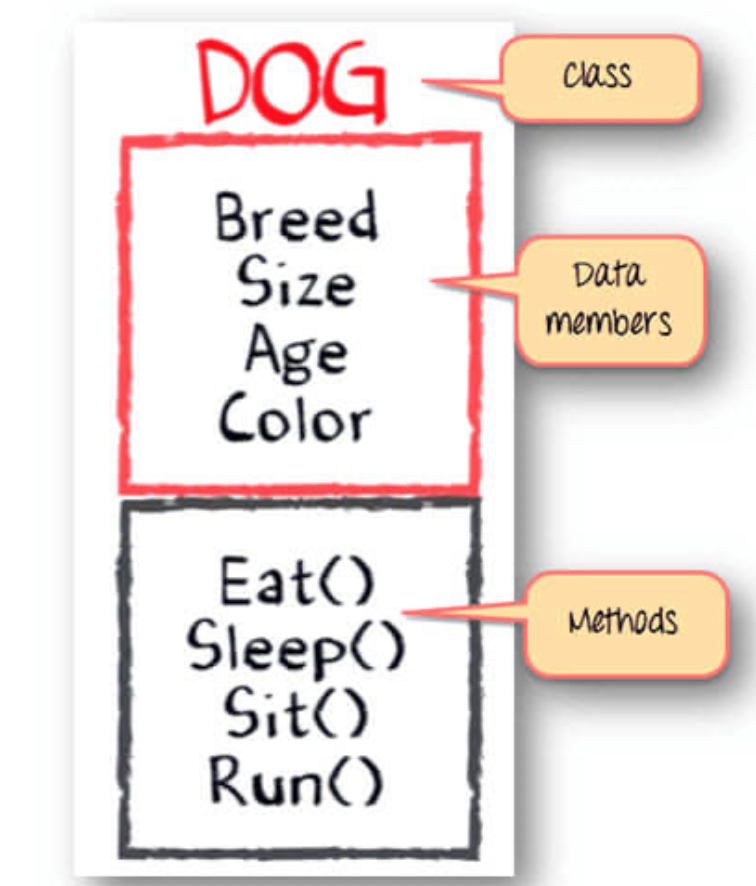
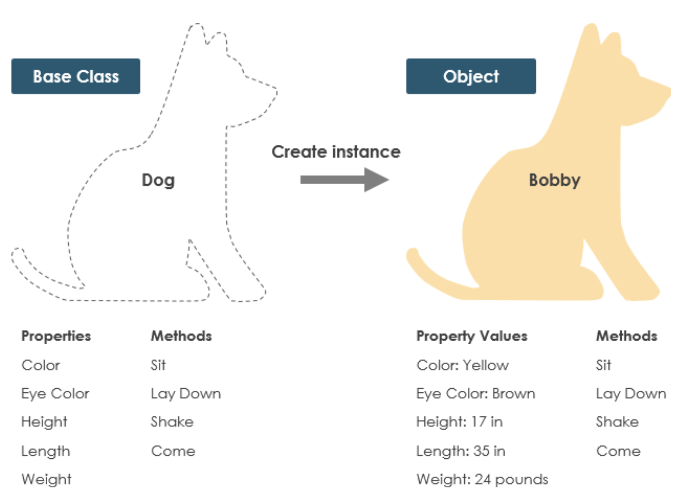

# OOP

## 정의

* 캡슐화, 다형성, 상속을 이용하여 코드 재사용을 증가 및 유지보수 감소의 장점을 얻기 위해 객체들을 연결시켜 프로그래밍 하는 것

* 각 객체와 그 객체들간의 관계를 설계하는 것

* ex) 카페에서의 객체

  

* 다음과 같은 기술을 지원한다면 객체 지향
  1. 추상화: 클래스나 객체 지원
  2. 상속: 이미 존재하는 것으로부터 새로운 형상을 만들어낼 능력을 제공
  3. 런타임 다형성: 수행 시간에 바인딩할 수 있는 어떠한 폼을 제공

* 객체들의 상호작용으로 동작

## 객체(Object)

### 1. 정의

* 데이터(상태) + 메서드(행위) 로써 정의됨.



### 2. Class vs Object

* Class

  * 추상(abstract), 표현 대상에 대한 이데아(형상) 

    ex1) '침대'라는 개념

    ex2) '강아지'라는 개념

  * 이상적인 존재 (이미지, 설계도, 틀, 설명서)
  * 공통의 특징

* Object

  * 실체(instance), 추상을 실체화한 대상

    ex1) 이케아 침대, 한샘 침대, 시몬스 침대, ...

    ex2) 말티즈, 웰시코기, 시바이누, ...

  * 이데아의 모사
  * 개별 속성

* 예시



## Class

### 1. 정의

* 변수, 상수 그리고 함수들로 만들어지는 객체

* 선언 방식

  ```swift
  /*
   class <#ClassName#>: <#SuperClassName#>, <#ProtocolName...#> {
     <#PropertyList#>
     <#MethodList#>
   }
   
   let <#objectName#> = <#ClassName()#>
   objectName.<#propertyName#>
   objectName.<#functionName()#>
   */
  ```

* 사용 법

  ```swift
  class Dog {
    let breed "Maltese"
    var color = "White"
    var eyeColor = "Black"
    var height = 30.0
    var weight = 6.0
    
    func sit() {
      print("sit")
    }
    func layDown() {
      print("layDown")
    }
    func shake() {
      print("shake")
    }
  }
  
  
  let bobby: Dog = Dog() // bobby는 Dog 클래스가 저장된 heap 영역의 시작 주소를 갖고 stack에 올라간다.
  bobby.breed = "Welsh Corgi" // error. 왜냐, breed는 let으로 선언됨
  bobby.color
  bobby.color = "Gray" // color는 var로 정의되었기 때문에 수정 가능.
  bobby.color
  bobby.sit()
  ```

* 클래스와 메모리(추후 정확히 알아봐서 수정)
  * 클래스 인스턴스는 heap에 저장되고 해당 heap 시작 주소는 stack에 올라간다. 그리고 해당 인스턴스 호출시 주소를 참조하여 호출한다. 따라서 let 으로 인스턴스를 만들어도 내용이 수정가능 함
  * let으로 인스턴스 생성하는 이유는 갖고 있는 주소값이 바뀌지 않도록 하기 위함

### 2. Class initialize

* Class의 초기화 메서드

* 초기화가 불필요한 경우: 모든 저장 프로퍼티에 초기값이 설정되어있음

  ```swift
  class Dog1 {
    let name = "Tory"
    let color = "Brown"
    
    func bowwow() {
      print("Dog1 Bowwow!")
    }
  }
  
  let tory = Dog1()
  // let tory = Dog1.init() // 불필요하다.
  tory.bowwow() // "Dog1 Bowwow!"
  tory.name // Tory
  tory.color // Brown
  ```

* 초기화 필요한 경우: 저장 프로퍼티 중 하나 이상이 초기값이 미설정되어있음. **init( ) 메서드**를 이용한다.

  방법 1) 파라미터 없는 경우

  ```swift
  class Dog2 {
    let name: String
    let color: String
    
    init() {
      name = "Tory"
      color = "Brown"
    }
    
    func bowwow() {
      print("Dog2 Bowwow!")
    }
  }
  
  let tory2 = Dog2()
  tory2.bowwow() // "Dog2 Bowwow!"
  tory2.name // Tory
  tory2.color // Brown
  ```

  방법 2) 파라미터 있는 경우 (외부에서 초기화 시키는 경우)

  ```swift
  class Dog3 {
    let name: String
    let color: String
  
    init(name: String) {
      self.name = name
      color = "Brown"
    }
    init(name: String, color: String) {
      self.name = name
      self.color = color
    }
    
    func bowwow() {
      print("Dog3 Bowwow!")
    }
  }
  // 인스턴스 생성과 함께 초기화
  var tory3 = Dog3(name: "Tory")
  var tory4 = Dog3(name: "Tory", color: "White")
  
  tory3.name // Tory
  tory3.color // Brown
  
  tory4.name // Tory
  tory4.color // White
  ```

### 3. Property

* 값을 제공하는 것
* 값을 '저장하고 제공' = Stored property
* 값을 '저장하지 않고 제공' = Computed property

#### 1) Stored property

* 클래스 내부에 선언된 변수 혹은 상수

##### Lazy stored property

* 해당 프로퍼티가 호출될때 해상 인스턴스를 초기화하는 속성

* 사용되는 케이스 3가지

  1. 해당 프로퍼티의 초기값이 다른 요인에 의해 바뀔 수 있을 때

     ```swift
     class LazyStoredProperty {
       var width = 10.0
       var height = 20.0
       
     //  var area = self.width * self.height // area가 아직 초기화 되지 않았으므로 self 키워드는 사용할 수 없다.
       lazy var area = width * height // lazy var area = self.width * self.height 랑 같은거임. lazy를 붙이면 self 사용 가능.
     }
     
     let lazyStored = LazyStoreProperty()
     lazyStored.width = 30
     lazyStored.width // 30
     lazyStored.height // 20
     lazyStored.area // 60. 변경된 width 값을 이용하여 area 값이 초기화 됨
       
     let lazyStored1 = LazyStoredProperty()
     lazyStored1.area // 10 * 20  = 200
     lazyStored1.width = 30
     lazyStored1.area // 200. 한번 초기화되면 직접 값을 바꾸지 않는 이상 초기화된 값이 유지된다.
     
     ```

  2. 초기값이 복잡하거나 계산 비용이 많이 드는 설정을 필요로 할 때(인스턴스 생성시 시간이 많이 걸리는 상황)

     ```swift
     class LazyStoredProperty {
       var width = 10.0
       var height = 20.0
     
       lazy var hardWork = "실행하면 약 10초 이상 걸려야 하는 작업"
     }
     ```

  3. 해당 프로퍼티가 필요한 경우가 제한적인 상황

     ```swift
     class LazyStoredProperty {
       func ifStatement() {
         if true {   // 5%. 사용될 확률이 5%
           print(area)
         } else {    // 95%. 사용될 확률이 95%
           print(width)
         }
       }
     }
     ```

#### 2) Computed property

* 자료를 저장하지 않고 매번 호출할 때 마다 새로 계산

  ```swift
  class ComputedProperty {
    var width = 5.0
    var height = 5.0
    
    lazy var lazyArea = width * height
    var area: Double { // 읽기 전용
      width * height // get을 생략한 형태
    }
    
    // Stored + Computed get(read), set(write)
    private var _koreanWon = 0.0
    var wonToDollar: Double {
      get {
        return _koreanWon / 1136.5
      }
      set {
        // newValue: 새로 들어오는 값
        _koreanWon = newValue //(newValue라고 안 쓸려면 set(something)에 선언해주고 써야함)
      }
    }
  }
  
  var computed = ComputedProperty()
  computed.area // 25
  computed.lazyArea // 25
  
  computed.width = 10
  computed.area // 50
  computed.lazyArea // 25. lazy 특성으로 선언된 프로퍼티는 최초에 한번 초기화되면 직접 값을 바꾸지 않는 이상 안바뀐다.
  
  computed.lazyArea = 50.0
  computed.lazyArea // 50. 직접 변경했으므로 바뀐다.
  
  computed.width = 20
  computed.height = 20
  computed.area // 400
  computed.lazyArea // 50
  computed.area = 1000 // error. area 프로퍼티에 set을 하는 부분이 없으므로.
  
  computed.wonToDollar // 0. 프로퍼티 wonToDollar의 returnd은 _koreanWon / 1136.5 인데, 지금 _koreanWon이 0이다.
  computed.wonToDollar = 10000 // set이 동작하여 _koreanWon에 10000을 할당
  computed.wonToDollar // 8.799... 10000/1136.5 계산 값이 반환됨
  ```

#### 3) Property observer

* 값이 바뀔 때 실행 willSet

* 값이 바뀌고 나서 실행 didSet

  ```swift
  class PropertyObserver {
    var height = 0.0
    
    var width = 25.0 {
      willSet {
        print("The width value has changed from \(width) inches to \(newValue) inches.")
        // width = 25.0,  newValue = 50.0
      }
      
      // 변경되는 시점  willSet <-> didSet 중간
      
      didSet {
        height = width / 2
        print("So the height value has also changed from \(oldValue / 2) inches to \(width / 2) inches.")
        // oldValue = 25.0,  width = 50.0
      }
    }
  }
  
  var obs = PropertyObserver()
  obs.width = 50
  //The width value has changed from 25.0 inches to 50.0 inches.
  //So the height value has also changed from 12.5 inches to 25.0 inches.
  ```

#### 4) Type property

* 인스턴스를 생성하지 않고 구조체나 클래스 자체에 값을 저장하는 프로퍼티

* 저장된 값은 모든 인스턴스가 공통으로 사용할 수 있다.(모든 인스턴스에서의 해당 프로퍼티는 모두 같은 값이다.)

* _**전역 범위가 아니라 해당 객체 내에서만 접근 가능하다.**_

* 선언 방식 및 사용 방법

  ```swift
  class TypeProperty {
    static var unit: String = "inches" // 클래스 내에서 static으로 선언
    var width = 5.0
  }
  let square = TypeProperty()
  square.width // 5.0
  
  let square1 = TypeProperty()
  square1.width = 10.0
  square1.width // 10.0
  
  TypeProperty.unit // "inches". 클래스 이름으로 직접 접근한다.
  print("\(square.width) \(TypeProperty.unit)")  // "5.0 inches"
  print("\(square1.width) \(TypeProperty.unit)") // "10.0 inches"
  
  TypeProperty.unit = "ft"
  print("\(square.width) \(TypeProperty.unit)") // "5.0 ft"
  print("\(square1.width) \(TypeProperty.unit)") // "10.0 ft"
  ```

### 4. Equatable protocol

* 클래스의 프로퍼티 끼리 비교를 가능하게 하는 방법

  ```swift
  class User: Equatable { // Equatable를 선언해주고
    var name = "이순신"
    let age = 30
    
    static func ==(lhs: User, rhs: User) -> Bool { // 비교를 위한 연산자 함수를 만들어준다.
      return lhs.name == rhs.name
    }
  }
  
  let user1 = User()
  var user2 = User()
  user1 == user2 // 비교가능해진다.
  ```

### 5. Identical

* 참조 타입의 비교 및 할당(?)

* ===: 메모리 주소가 같은지 비교하는 것

  ```swift
  class User: Equatable { // Equatable를 선언해주고
    var name = "이순신"
    let age = 30
    
    static func ==(lhs: User, rhs: User) -> Bool { // 비교를 위한 연산자 함수를 만들어준다.
      return lhs.name == rhs.name
    }
  }
  
  let user1 = User()
  var user2 = User()
  
  user1.name // "이순신"
  user2.name // "이순신"
  user1 == user2 // true. 값이 같다.
  user1 === user2 // false. 서로 다른 메모리에 저장된 객체
  
  user1.name = "홍길동"
  user1.name   // "홍길동"
  user2.name   // "이순신"
  user1 == user2 // false. 값이 달라졌다.
  user1 === user2 // false. 참조 주소값은 원래 다르다.
  
  user2 = user1 // user1의 메모리 주소값을 user2의 메모리 주소값에 덮어쓴다
                //ARC에 의해 기존에 힙에 할당된 user2의 메모리를 해제함.
  
  /* ARC 개념 start*/
  var user3 = User() // user3(시작주소: 0x34, count: 1)
  var user4 = User() // user4(시작주소: 0x12, count: 1)
  
  user4 = user3 // user3, user4(시작주소: 0x34, count: 2)
                // 주소: 0x12, count 0 => 할당된 메모리(0x12 번지) 해제
  /* ARC 개념 end*/
  
  user1.name // 홍길동
  user2.name // 홍길동
  user1 == user2    // true. 내용뿐 아니라
  user1 === user2   // true. 참조 주소까지 같아짐.
  
  user2.name = "세종대왕"
  user2.name // "세종대왕"
  user1.name // "세종대왕". 주소값을 참조해서 내용을 바꾸므로 같이 바뀐다.
  ```

### 6. 메모리에 관하여

* let x: Int = 100 => 크기가 예측이 가능한 데이터 => stack에 정적으로 할당
* var arry: [Int] = [] => 크기가 예측 불가능한 데이터 => heap에 동적으로 할당(빈곳을 찾아다니면서 할당해줌)
* 속도는 stack > heap
* Objective-C에서는 Class가 많이 활용되었으나 Swift에서는 Struct가 많이 사용됨
* Int 등은 struct로 만들어짐
* UIKit은 기본 베이스가 클래스이고, SwiftUI는 기본 베이스가 스트럭트