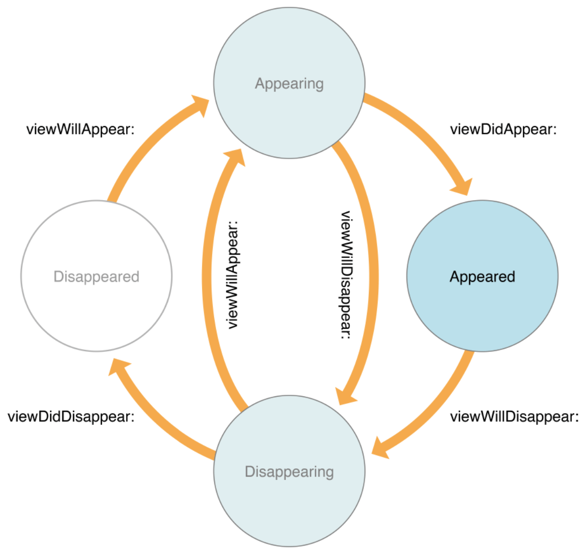

# ViewController

## 1. 정의

* 윈도우와 뷰 사이를 연결

## 2. 역할

### 1) View management

* 뷰의 계층을 관리
* 모든 뷰 컨트롤러마다 Root View를 가지며, 화면에 표시되기 위해선 해당 Root View에 속해야한다.

#### Type

##### (1) Content View Controller

* 각자가 하나의 화면(Scene)을 담당
* 종류: UIViewController, UITableViewController, UICollectionViewController 등

##### (2) Container View Controller

* 내부에 다른 뷰 컨트롤러(루트 뷰)를 배치하고 이들 관계를 관리
* 종류: UINavigationController, UITabbarController, UIPageViewController 등


### 2) Data Marshaling

* MVC(Model-View-Controller)
* 자신이 관리하는 View와 Data간의 중개 역할


### 3) User Interaction

* 이벤트 처리

  방법1 ) 발생한 이벤트를 연관된 객체에 액션 메서드(@IBAction)나 delegate를 통해 전달

  방법2 ) 발생한 이벤트를 직접 받아 처리 (지양)


### 4) Resource Management

* 뷰컨트롤러가 생성한 모든 뷰와 객체들은 뷰컨트롤러의 책임
* 뷰컨트롤러의 생명주기에 따라 생성되었다가 자동 소멸되기도 하지만 ARC 개념에 맞게 관리 필요
* 메모리 부족시 didReceiveMemoryWarning 메서드에서 꼭 유지 하지 않아도 되는 자원들 정리 필요


### 5) Adaptivity

* 뷰컨트롤러는 뷰의 표현을 책임지고, 현재 환경에 적절한 방법으로 적용되도록 할 책임을 가짐


## 3. window와 Root View Controller

### 1. window

* UIWindow는 그 자체로는 유저에게 보여지는 컨텐츠를 가지지 못함
* Window는 정확히 하나의 Root view controller를 가지는데 이것을 통해 컨텐츠를 표현.
* 여러가지 뷰를 올리기위한 가장 밑바탕이 되는 뷰
* UILabel 처럼 여러개를 생성할 수 도 있음. 그러나 기본적으로는 하나만 생성.

### 2. window 초기화

* AppDelegate 혹은 SceneDelegate에서 window를 초기화 시킬 수 있다.

  방법1) AppDelegate: SceneDelegate에서 안쓰는 경우(iOS 12 이하). 스토리보드 안쓰는 경우.

  ```swift
  import UIKit
  
  @UIApplicationMain
  class AppDelegate: UIResponder, UIApplicationDelegate {
  
      var window: UIWindow?
  
      func application(_ application: UIApplication, didFinishLaunchingWithOptions launchOptions: [UIApplication.LaunchOptionsKey: Any]?) -> Bool {
          
          // 스토리보드, SceneDelegate.swift 안 쓸 때 초기 윈도우 세팅(iOS 12.0 이하)
          if #available(iOS 13.0, *) {
              
          }
          else {
              window = UIWindow(frame: UIScreen.main.bounds)
              window?.rootViewController = ViewController()  // 앱의 시작 지점. 앱의 시작 뷰컨트롤러를 지정.
              window?.backgroundColor = .blue
              window?.makeKeyAndVisible()
          }
          return true
      }
  ```
  
  방법2 ) SceneDelegate: AppDelegate 안쓰는 경우(iOS 13 이상). 스토리보드 안쓰는 경우
  
  ```swift
  import UIKit
  
  class SceneDelegate: UIResponder, UIWindowSceneDelegate {
  
      var window: UIWindow? // optipnal
  
      func scene(_ scene: UIScene, willConnectTo session: UISceneSession, options connectionOptions: UIScene.ConnectionOptions) {
          guard let windowScene = (scene as? UIWindowScene) else { return }
      
          //스토리보드를 사용하지 않고 개발할 때 필요한 window 세팅(iOS 13.0 이상)
          window = UIWindow(windowScene: windowScene)
          window?.rootViewController = ViewController() // window의 Root View Controller를 ViewController.swift의 ViewController로 설정
          window?.frame = UIScreen.main.bounds
          window?.backgroundColor = .blue // window의 배경색 지정
          window?.makeKeyAndVisible() // window가 여러개일 경우, 핵심 키 윈도우를 지정해주는 것
      }
  }
  ```
  
  
## 4. View Controller Life Cycle



## 5. 화면전환 구현

### 1) Storyboard를 사용하지 않을 때 설정 방법

#### (1) AppDelegates.swift

```swift
    func application(_ application: UIApplication, didFinishLaunchingWithOptions launchOptions: [UIApplication.LaunchOptionsKey: Any]?) -> Bool {
        
        // 스토리보드, SceneDelegate.swift 안 쓸 때 초기 윈도우 세팅(iOS 12.0 이하)
        if #available(iOS 13.0, *) {
            
        }
        else {
            window = UIWindow(frame: UIScreen.main.bounds)
            window?.rootViewController = ViewController()  // window의 Root View Controller를 ViewController.swift의 ViewController로 설정
            window?.backgroundColor = .blue
            window?.makeKeyAndVisible()
        }
        return true
    }
```

#### (2) SceneDelegates.swift

```swift
    func scene(_ scene: UIScene, willConnectTo session: UISceneSession, options connectionOptions: UIScene.ConnectionOptions) {
        guard let windowScene = (scene as? UIWindowScene) else { return }
    
        //스토리보드를 사용하지 않고 개발할 때 필요한 window 세팅(iOS 13.0 이상)
        window = UIWindow(windowScene: windowScene)
        window?.rootViewController = ViewController() // window의 Root View Controller를 ViewController.swift의 ViewController로 설정
        window?.frame = UIScreen.main.bounds
        window?.backgroundColor = .blue // window의 배경색 지정
        window?.makeKeyAndVisible() // window가 여러개일 경우, 핵심 키 윈도우를 지정해주는 것
    }
```


### 2) 전환 방식: presentation 방식

#### (1) present

```swift
import UIKit

class ViewController: UIViewController { // VC. presentingViewController

    override func viewDidLoad() {
        super.viewDidLoad()
        
        let button = UIButton(type: .system) // 버튼 생성
        button.frame = CGRect(x: 200, y: 200, width: 100, height: 50)
        button.center = view.center
        button.setTitle("Present", for: .normal)
        button.addTarget(self, action: #selector(didTapButton(_:)), for: .touchUpInside)
        view.addSubview(button)
    }

    @objc func didTapButton(_ sender: UIButton) { // 버튼 이벤트 발생 시 present
        let newVC = NewViewController()
        newVC.view.backgroundColor = .brown
        newVC.modalPresentationStyle = .automatic // .fullscreen
        present(newVC, animated: true) // NewViewController present
    }

}
```

#### (2) dismiss

```swift
import UIKit

class NewViewController: UIViewController { // newVC. presentedViewController

    override func viewDidLoad() {
        super.viewDidLoad()
        
        let button = UIButton(type: .system)
        button.frame = CGRect(x: 0, y: 0, width: 100, height: 50)
        button.setTitle("Dismiss", for: .normal)
        button.center = view.center
        button.addTarget(self, action: #selector(didTapButton), for: .touchUpInside)
        view.addSubview(button)
    }

    @objc func didTapButton(_ sender: UIButton) { // 버튼 이벤트 발생 시
        dismiss(animated: true) // 해당 View Controller dismiss
    }
}
```


### 3) Life Cycle

#### (1) 풀스크린

* 기본 화면 VC(presentingViewController)과 새로 나타날 화면 newVC(presentedViewController) 모두 제어

##### 1) 앱 실행

viewDidLoad - VC(presentingViewController)

viewWillAppear - VC(presentingViewController)

viewDidAppear - VC(presentingViewController)

##### 2) 앱 실행 완료

##### 3) 버튼 클릭(present)

viewDidLoad - New VC(presentedViewController)

viewWillDisappear - VC(presentingViewController)

viewWillAppear - New VC(presentedViewController)

viewDidAppear - New VC(presentedViewController)

viewDidDisappear - VC(presentingViewController)

##### 4) 화면전환 완료

##### 5) 버튼 재클릭(dismiss)

viewWillDisappear - New VC(presentedViewController)

viewWillAppear - VC(presentingViewController)

viewDidAppear - VC(presentingViewController)

viewDidDisappear - New VC(presentedViewController)

Deini - New VC (presentedViewController는 메모리상에서 삭제)

##### 6) 원래 화면으로 복귀 완료


#### (2) 카드방식

* 새로 나타날 화면 newVC(presentedViewController)만 제어
* isMoalIn 을 사용하면 끌어내려서 종료하지 못하게 할 수 있음
* 좀 더 구체적인 디스미스 제스쳐를 제어할 수 있음.

##### 1) 앱 실행

viewDidLoad - VC(presentingViewController)

viewWillAppear - VC(presentingViewController)

viewDidAppear - VC(presentingViewController)

##### 2) 앱 실행 완료

##### 3) 버튼 클릭(present)

viewDidLoad - New VC(presentedViewController)

viewWillAppear - New VC(presentedViewController)

viewDidAppear - New VC(presentedViewController)

##### 4) 화면전환 완료

##### 5) 버튼 재클릭(dismiss)

viewWillDisappear - New VC(presentedViewController)

viewDidDisappear - New VC(presentedViewController)

Deini - New VC (presentedViewController는 메모리상에서 삭제)

##### 6) 원래 화면으로 복귀 완료


#### (3) 카드방식 제스처 dismiss

```swift
    @objc func didTapButton(_ sender: UIButton) {
        let newVC = NewViewController()
        newVC.view.backgroundColor = .brown
        newVC.modalPresentationStyle = .automatic
        newVC.isModalInPresentation = false // true일 때는 제스쳐 dismiss 막힘
        present(newVC, animated: true)
    }
```


#### (4) 비고

* dismiss후 재 전환 시 VC(presentingViewController)의 viewDidLoad가 실행 안되는 이유

  VC(presentingViewController)는 한번 메모리에 올려지면 종료가 안되지만 next VC(presentedViewController)는 dismiss 할때마다 메모리에서 삭제되므로 새로 실행할때마다 viewDidLoad 실행됨.

  

### 4) 다른 뷰컨트롤러에 데이터 전달하기

```swift
    @objc private func didTapButton(_ sender: UIButton) {
//        presentgingViewController - 나를 띄운 VC (VC)
//        presentedViewController - 내가 띄운 VC (new VC)
//        self.presentingViewController // VC
//        self.presentingViewController.presentedViewController // nexw VC
        
        let colors: [UIColor] = [.red, .blue, .green, .gray, .black]
        presentingViewController?.view.backgroundColor = colors.randomElement()!
        
        // presentingViewController?.presentingViewController //나를 띄운 놈의 띄운 놈
        dismiss(animated: true) // 닫을 때 필요한 함수
    }
```

### 5) 다수 ViewController에서의 전환

```swift
// A->B->C
// C 에서 B로 가려면,
presentingViewController.dismiss(animated: true) // 정석
// C 에서 A로 바로 가려면,
presentingViewController.presentingViewController.dismiss(animated: true) // 길어짐
```

### 6) 피해야할 전환방식

```swift
// dismiss가 아닌 presentingViewController를 아래와 같이 present(생성)해버리면, 메모리에 계속 생성된다.
let vc = ViewController()
present(vc, animated: true)
```

