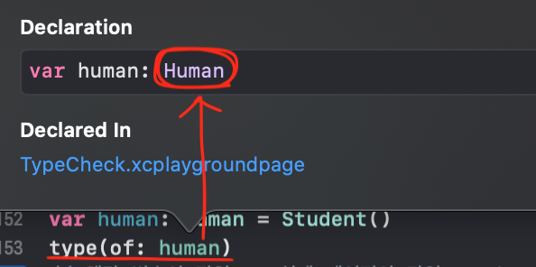

# Type casting

## 타입 확인

### type(of: )

* 런타임때의 타입을 반환한다.

### Any

* 아무 타입이나 사용가능 하나, 특정 타입에 해당하는 프로퍼티나 메서드 사용 불가

  ```swift
  let anyArr: [Any] = [1, 2.0, "3"]
  type(of: anyArr[0]) // Int
  type(of: anyArr[1]) // Double
  type(of: anyArr[2]) // String
  anyArr[0]. // 이 경우에, Int 타입 프로퍼티나 메서드를 사용할 수 없음. 그냥 .self 밖에 없음.
  ```

  

### 제네릭

* 함수 호출 시, 전달 인자에 따라 타입이 정해진다.(타입이 동적으로 변한다.)

  ```swift
  // Generic
  func printGenericInfo<T>(_ value: T) {
    let types = type(of: value) // 만약 value가 Int 타입이 전달되면, value는 함수 내에서 Int로 고정됨
    														// T 대신 Any로 선언될 경우, value는 함수 내에서 Int로 고정되지 않음?
    print("'\(value)' of type '\(types)'")
  }
  printGenericInfo(1) // Int
  printGenericInfo(2.0) // Double
  printGenericInfo("3") // String
  ```

## 타입 비교 연산

### is 연산자

#### 변수/상수 비교

* 변수(or 상수) is 비교대상 타입 

  ```swift
  let number = 1
  number == 1    // 값 비교
  number is Int  // 타입 비교

  // 응용
  let someAnyArr: [Any] = [1, 2.0, "3"]

  for data in someAnyArr {
    if data is Int {
      print("Int type data :", data)
    } else if data is Double {
      print("Double type data : ", data)
    } else {
      print("String type data : ", data)
    }
  }
  ```

#### 클래스 인스턴스 비교

* 인스턴스(or 인스턴스가 할당된 변수/상수) is 비교할 타입

  ```swift
  /*
      Human
     /     \
   Baby   Student
            |
      UniversityStudent
   */

  let student = Student()
  student is Human // true. Human은 부모 클래스
  student is Baby // false. Baby는 아무 관련 없는 클래스
  student is Student // true. Student는 자기자신

  let univStudent = UniversityStudent()
  student is UniversityStudent. UniversityStudent는 자식 클래스

  let someArr = [Human(), Baby(), UniversityStudent()]
  // someArr은 Human 타입으로 추론됨(세개의 클래스 요소의 최상위 클래스가 Human 클래스 이므로)
  // 따라서 아래와 동식
  // let someArr: [Human] = [Human(), Baby(), UniversityStudent()].
  type(of: someArr) // Array<__lldb_expr_45.Human>.Type
  
  someArr[0] is Human    // t
  someArr[0] is Student  // f
  someArr[0] is UniversityStudent  // f
  someArr[0] is Baby     // f
  
  someArr[2] is Human    // t
  someArr[2] is Student  // t
  someArr[2] is UniversityStudent  // t
  someArr[2] is Baby     // f
  ```


### 주의사항

* 변수가 선언된 타입을 기준으로 비교하는 것이 아니라 변수에 할당된 실제 인스턴스를 기준으로 타입을 비교한다.

  ```swift
  var human: Human = Student() 
  if human is Student { // 변수(human)이 선언된 타입(Human)이 아니라 실제로 할당된 인스턴스의 타입(Student)이 비교된다.
    print("human은 Student 타입입니다.") // print 됨
  }
  else {
    print("human은 Student 타입이 아닙니다.")
  }
  
  type(of: human) // __lldb_expr_49.Student.Type
  ```

<br></br>

## <span style="color: red;">타입 캐스팅의 필요성!!</span>

```swift
let human: Human = Student()
```

위의 주어진 구문에서 human 상수는 실제로는 Student 클래스의 인스턴스가 할당되어 있지만, 아래 사진과 같이 컴파일러는 이 상수를 Human 타입으로 간주한다. 타입 어노테이션(타입 선언)이 실제 대입된 값의 타입보다 우선하기 때문이다.



따라서 Human 클래스에서 선언되지 않은 프로퍼티나 메소드를 사용할 수 없다. 사용할 수 없다는 뜻은 'xcode상에서 코딩할 때 .으로 참조 불가능'이라는 뜻.

```swift
 human.name
 human.school // Value of type 'Human' has no member 'school'. 컴파일러가 human을 Human 타입으로 간주하기 때문에 Student의 프로퍼티인 school을 참조할 수 없다.
```

이를 해결하기 위해 제한적으로 타입을 변환할 수 있는 기능이 바로 'Type Casting'

타입이 추론된 경우도 마찬가지

```swift
var james = Student() // 이 때 타입이 결정된다.
james = UniversityStudent() // Student의 하위 클래스인 UniversityStudent 클래스를 할당 받을 수 있다.
type(of: james) // 실행결과(실제 할당된 값의 타입)은 UniversityStudent

james.name     // Human 속성. 참조 가능
james.age      // Baby 속성. 참조 불가능. 왜냐, Student와 상관없는 클래스 타입
james.school   // Student 속성. 참조 가능
james.univName // UniversityStudent 속성. 참조 불가능. 왜냐, 컴파일러는 Student 타입으로 간주.
```

해결방법은 바로 타입 캐스팅

```swift
if let james = james as? UniversityStudent {
    james.univName = "Seoul" // 참조 가능해짐
}
```


<br></br>

## Type Casting

### Upcasting

*  업 캐스팅

   \- 상속 관계에 있는 자식 클래스가 부모 클래스로 형 변환하는 것

   \- 업캐스팅은 항상 성공하며 as 키워드를 사용(자기 자신에 대한 타입 캐스팅도 항상 성공하므로 as 키워드 사용)

   ```swift
   class Shape {
     var color = UIColor.black
     
     func draw() {
       print("draw shape")
     }
   }
   
   class Rectangle: Shape {
     var cornerRadius = 0.0
     override var color: UIColor {
       get { return .white }
       set { }
     }
   
   let rect = Rectangle()
   rect.color // white
   rect.cornerRadius // 0
   
   let t1 = rect as Shape
   t1.color // white. black이 아닌 이유. 업캐스팅을 한다고해서 최초 할당된 인스턴스가 바뀌는것이 아니다???
   let t2 = rect as Rectangle
   t2.color // white
   t2.cornerRadius // 0
   
   (rect as Shape).color // white. black이 아닌 이유. 업캐스팅을 한다고해서 최초 할당된 인스턴스가 바뀌는것이 아니다???
   //(rect as Shape).cornerRadius // .cornerRadius는 Rectangle의 프로퍼티이기 때문에 접근 불가능.
   
   (rect as Rectangle).color // white
   (rect as Rectangle).cornerRadius // 0
   
   let upcastedRect: Shape = Rectangle()
   type(of: upcastedRect)   // Rectangle
   
   upcastedRect.color
   //upcastedRect.cornerRadius //upcastedRect를 컴파일러가 Shape 타입으로 간주하기 때문에 Rectangle의 프로퍼티인 .cornerRadius에 접근할 수 없음.
   
   (upcastedRect as Shape).color
   //(upcastedRect as Rectangle).color // Shape as Rectangle이 되는건데. 이경우에는 다운캐스팅이기때문에 as? 혹은 as!이 되어야한다. 수정 후 결과는
   
   //부모 클래스 타입으로는 항상 변경할 수 있는데, 자식 클래스로 변경할 수는 없는 이유?
   //자식 클래스 타입 <= 부모 크래스 타입
   //자식 클래스 타입 => 부모 크래스 타입
   //
   
   ```
   
   

### Downcasting

*  다운 캐스팅

   \- 형제 클래스나 다른 서브 클래스 등 수퍼 클래스에서 파생된 각종 서브 클래스로의 타입 변환 의미

   \- 반드시 성공한다는 보장이 없으므로 옵셔널. as? 또는 as! 를 사용
   
   ```swift
   let shapeRect: Shape = Rectangle()
   var downcastedRect = Rectangle()
   
   //downcastedRect = shapeRect // shapeRect는 Shape 타입
   //downcastedRect = shapeRect as Rectangle // 상위를 하위로 변환하는 다운캐스팅
   
   //downcastedRect: Rectangle = shapeRect as? Rectangle  // 변환이 성공하면 optional, 실패하면 nil. 따라서 애초에 downcastRect를 옵셔널 타입으로 선언해야함. 혹은 as! 를 사용해야함.
   downcastedRect = shapeRect as! Rectangle  //
   
   //as? : 강제 타입 변환 시도. 변환이 성공하면 Optional 값을 가지며, 실패 시에는 nil 반환
   //as! : 강제 타입 변환 시도. 성공 시 언래핑 된 값을 가지며, 실패 시 런타임 에러 발생
   
   
   
   //Q. 아래 value 에 대한 Casting 결과는?
   let value = 1
   //(value as Float) is Float   // 그냥 error. 왜냐, Int와 Float는 서로 관련이 없으므로 타입 캐스팅 불가. 아예 Float(1) 이런식으로 해야함.
   //(value as? Float) is Float  // false. 왜냐, nil is Float가 되어서 false
   //(value as! Float) is Float  // error. Int와 Float의 as 연산 자체가 nil이 나오므로.
   ```
   
   

