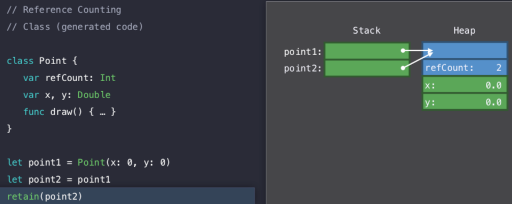
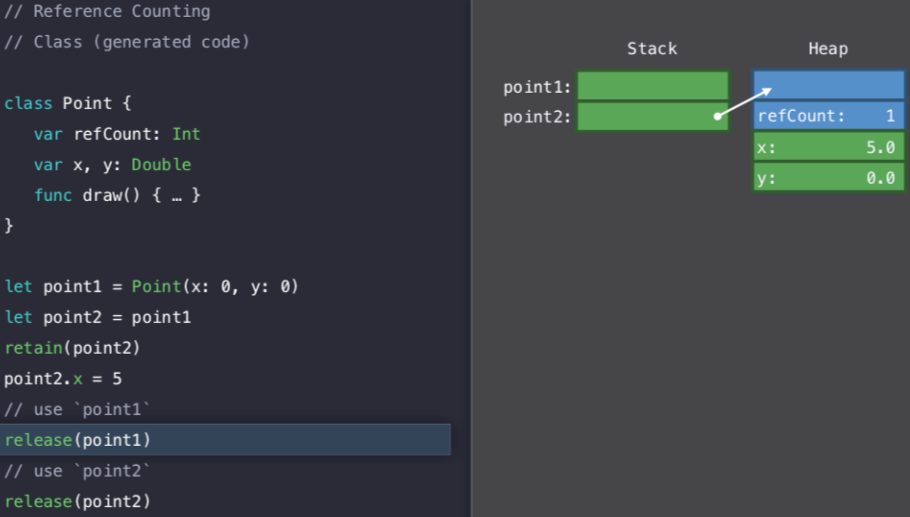
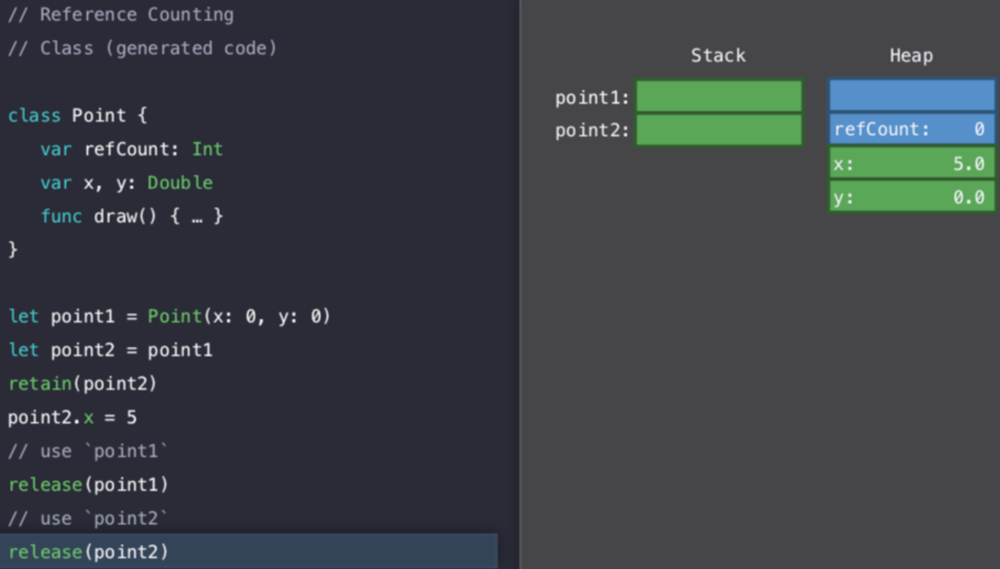
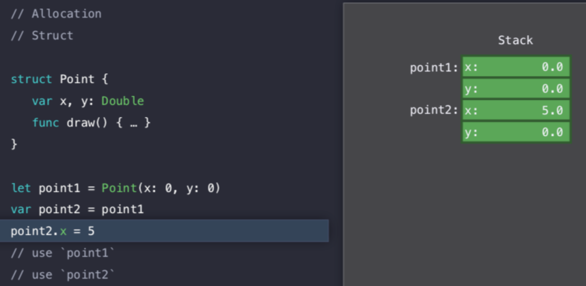
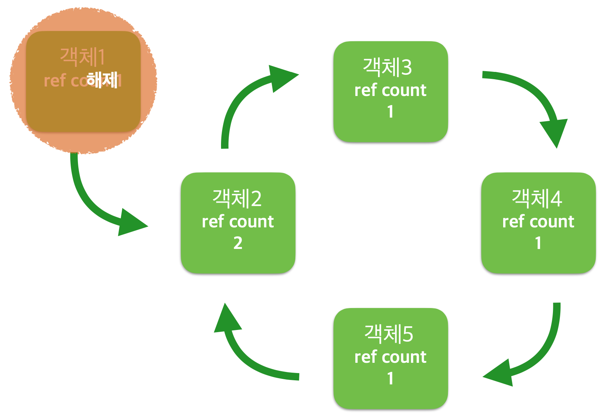
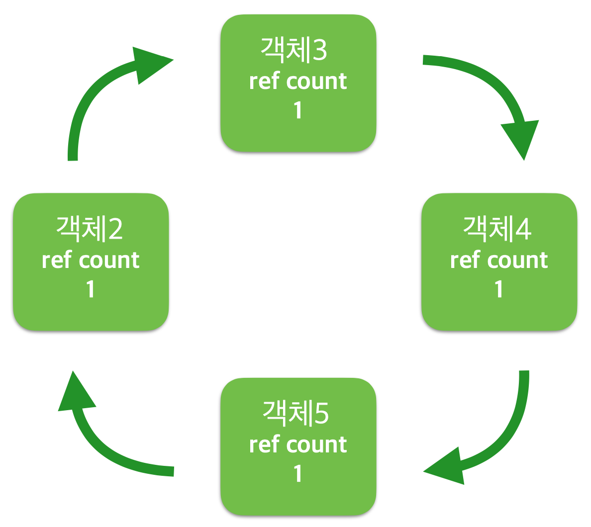
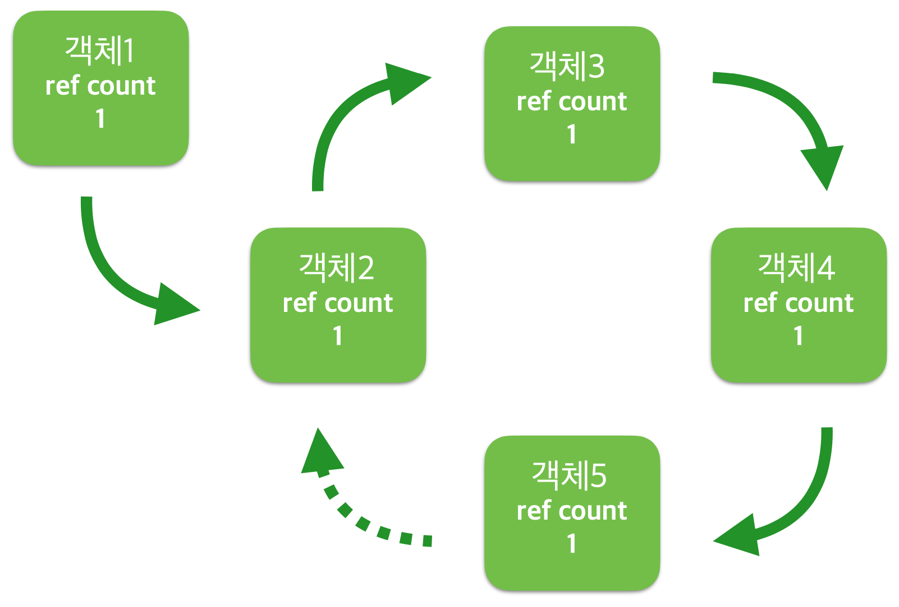

# Memory Management

<br>

## ARC

### 이전 방식

1. GC(Garbage Collector)
  * 단점: 런타임에 돈다(일시적 성능저하 가능)
2. MRR(Manual Retain Releaser/MRC(Manual Referece Counting)
   * objective-c에서 사용
   * RC(Reference Counting)을 통해 메모리를 수동으로 관리
   * retain / release / autorelease 등의 메모리 관리 코드를 직접 호출
   * 개발자가 명시적으로 rc를 증가시키고 감소시키는 작업수행
   * 손이 많이 간다
3. 예시
```objective-c
int main(int argc, const char * argvp[]) {
  Person *man = [[Person alloc]init]; // count 1
  [man doSomething]; // count 1

  [man retain]; // 메모리 추가 count 2
  [man doSomething]; // count 2
  
  [man release]; // count 1
  [man release]; // count 0
}
```

<br>

### Memory Lack / Dangling Pointer

* 카운트 할당(alloc, retain)과 해제(release)가 균형이 맞아야한다.
* 할당이 많으면 => memory lack 메모리 누수
* 해제가 많으면 => dangling pointer 허상(비어있거나 이상한 값이 들어있음) 발생
* 메모리 카운트가 0이 되어야 메모리에서 삭제

<br>

### 두둥등장 ARC

* 메모리관리의 어려움
* xcode static analyzer 같은 툴이 있었음(objective-c)
* RC 자동 관리 방식
* 컴파일러가 자동으로 retain / release를 코드에 삽입
* 런타임이 아닌 컴파일 단에서 처리(Heap 스캔 불필요/성능 저하 없음)

<br>

### ARC(Automatic Referece Counting). 

* 클래스 인스턴스에만 적용(즉, 참조타입에만 적용됨)

* 참조타입 종류
  1. strong: default. 참조될 때마다 참조카운트 1증가
  2. weak, unowned: 참조 카운트 증가시키지 않음
  
* 강한 순환 참조(Strong Reference Cycles) 주의 필요

* 예시 코드(런타임에서 stack 공간과 heap 공간이 할당된다.)

   1. 인스턴스 생성과 retain
    
   2. release
    
   3. release와 메모리 해제
    

<br>

### ARC in Struct

* Struct는 stack에 바로 올라간다.

  

<br>

### Strong Reference Cycle

* 객체에 접근 가능한 연결이 모두 끊어졌지만 순환참조에 의해 참조 카운트(RC)가 살아있어서 메모리 누수 발생
* 성능 저하 혹은 오동작으로 이어짐
* 발생 메커니즘
  1. 순환 외부 참조 해제
   
  2. 강한 참조 순환 발생
   

* 해결방법
  * 두개의 참조가 되는 객체에 걸려있는 참조 중 하나를 weak로
  
  

<br>

## ARC basic

면접에서 100% 물어본다

<br>

### Allocation and Release
```swift
var obj1: Person? = Person(testCase: "case1") // stack 0x1234, count 1
obj1 = nil // nil, count 0 => deinit
```
<br>
### 참조 카운트 증가
```swift
var obj2: Person? = Person(testCase: "case2") // count 1
var countUp = obj2 // count 2

obj2 = nil // count 1
countUp = nil // count 0 => deinit
```
<br>
### Collection에 의한 참조 카운트
```swift
var obj4: Person? = Person(testCase: "something") // count 1
var obj3: Person? = Person(testCase: "case3") // count 1
var array = [obj3, obj3, obj4] // obj3 count 3

obj3 = nil // obj3 count 2
array.remove(at: 2) // obj4 count 0 => deinit
//obj4 = nil // obj4 count 0 => deinit
array.remove(at: 0) // obj3 count 1
array.remove(at: 0) // obj3 count 0 => deinit

// count는 결국 절대적인 참조 횟수에 대한 값이다
```
<br>
### 강한 참조, 약한 참조
* strong : 기본값. 강한 참조. Reference Count 1 증가
* unowned : 미소유 참조. Count 증가하지 않음. 참조 객체 해제 시에도 기존 포인터 주소 유지
* weak : 약한 참조. Count 증가하지 않음. 참조하던 객체 해제 시 nil 값으로 변경
```swift
var strongObj4 = Person(testCase: "case4") // count 1
print(strongObj4) // strongObj4 실행

weak var weakObj4 = Person(testCase: "case4") // count 0 => 만들자 마자 deinit
print(weakObj4) // nil

unowned var unownedObj4 = Person(testCase: "case4") // count 0 => 만들자 마자 deinit
print(unownedObj4) // error. unowned는 만들어진 주소(예를 들어 0x1234)를 유지한다. 따라서 현재 Person은 0x1234 주소에 없으므로 error.
```
* 참조와 자료형
```swift
// 다음 4줄의 코드 중 사용 불가능한 것은?
unowned let unownedLet = strongObj4
unowned var unownedVar = strongObj4
//weak let weakLet = strongObj4 // weak은 값이 없는 경우 nil로 값이 바뀌기 때문에 let으로 선언 불가
weak var weakVar = strongObj4

// unowned 와 weak 의 타입은?
print("Unowned type: ", type(of: unownedVar)) // optional
print("Weak type: ", type(of: weakVar)) // non-optional
```
<br>

## Scope
* 스코프 범위에 의한 할당과 해제
```swift
class LocalScope {
  func doSomething() {}
  deinit {
    print("LocalScope is being deinitialized")
  }
}

class ClassProperty {
  func doSomething() {}
  deinit {
    print("ClassProperty is being deinitialized")
  }
}

class Application {
  var prop = ClassProperty() // prop count 1
  
  func allocateInstance() { // 생성시점:, 해제시점:
    let local = LocalScope() // local count 1
    local.doSomething()
  } // => local count 0 deinit
  
  deinit {
    print("Application is being deinitialized")
  }
} // => prop count 0 => deinit


// Q. 아래의 코드 실행 시 출력되는 메시지는?
var app: Application? = Application() //
app?.prop.doSomething() // "ClassProperty is being deinitialized"
app?.allocateInstance() // "LocalScope is being deinitialized"

// Q. ClassProperty 객체의 deinit 메서드가 호출되려면 어떻게 할까요?
// 1. app이 메모리 해제되면
// 2. app?.prop = nil
```
<br>
## Strong Reference Cycles
* 강한 참조 순환 구조
```swift
class Person {
  var pet: Dog?
  func doSomething() {}
  deinit {
    print("Person is being deinitialized")
  }
}

class Dog {
  var owner: Person?
  func doSomething() {}
  deinit {
    print("Dog is being deinitialized")
  }
}

// Person 과 Dog는 순환 참조 구조

var giftbot: Person? = Person() // Person count 1
var tory: Dog? = Dog() // Dog Count 1

giftbot?.pet = tory // Dog count 2
tory?.owner = giftbot // Person count 2

// 해제를 원해서 nil을 넣었지만
giftbot = nil // Person count 1. deinit 실행 안된다.
tory = nil // Dog count 1. deinit 실행 안된다.

// Why?
// 순환 참조 발생
```
* 해결방법
```swift
// 순서 주의

giftbot?.pet = nil // Dog count 1
tory?.owner = nil // Person count 1

giftbot = nil // Person count 0 => deinit
tory = nil // Dog count 0 => deinit

// 순서바뀌면, nil만 할당되고 메모리 해제 안됨
giftbot = nil
tory = nil

giftbot?.pet = nil
tory?.owner = nil
```
<br>
## Strong, Weak, Unowned Reference Cycles Relastionship
* 강한, 약한 참조가 혼합된 상황에서의 순환 발생
```swift
class Teacher {
//  var student: Student?
  weak var student: Student?
  deinit {
    print("Teacher is being deinitialized")
  }
}

class Student {
  // strong, unowned, weak
  let teacher: Teacher
//  unowned let teacher: Teacher
//  weak var teacher: Teacher?
  
  init(teacher: Teacher) {
    self.teacher = teacher
  }
  deinit {
    print("Student is being deinitialized")
  }
}

var teacher: Teacher? = Teacher() // teacher count 1
var student: Student? = Student(teacher: teacher!)// student count 1(if teacher is strong, teacher count 2)
teacher?.student = student //student count 2
```
* 순환 해제 방법
  1. strong: 명시적으로 nil 대입 필요. teacher?.student = nil
  2. unowned: 자동으로 deinit. nil 처리 된 속성에 접근하면 런타임 에러 발생
  3. weak: 자동으로 deinit. nil 처리 된 속성에 접근하면 nil 반환
  ```swift
  print("\n---------- [ teacher release ] ----------\n")
  // case 1: student strong, teacher strong
  teacher?.student = nil
  student = nil
  
  // case 2: student strong, teacher unowned
  teacher = nil
  
  // case 3: student weak, teacher strong
  teacher = nil
  
  print("\n---------- [ student release ] ----------\n")
  // case 1: student strong, teacher strong
  teacher = nil
  
  // case 2: student strong, teacher unowned
  student = nil
  
  // case 3: student weak, teacher strong
  student = nil
  ```
